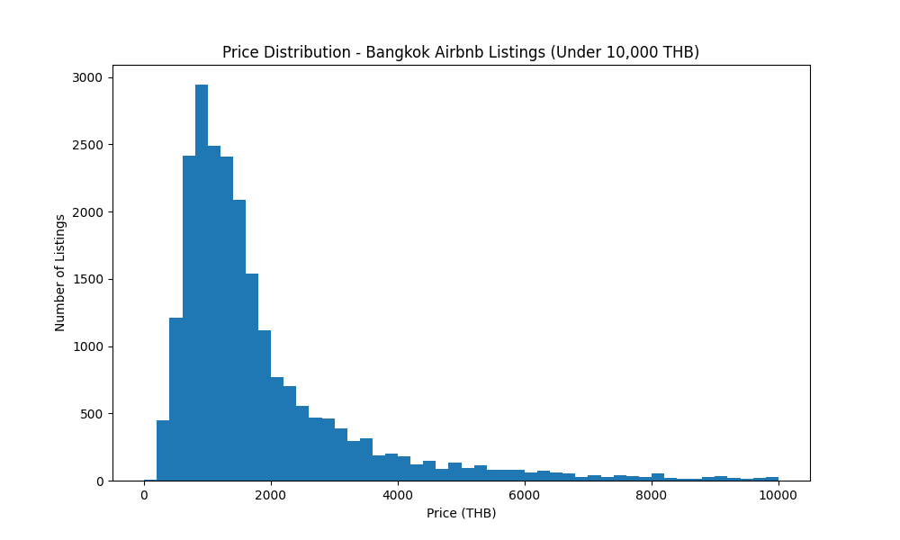
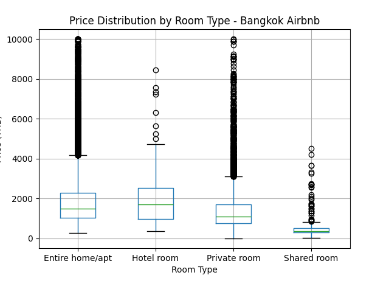
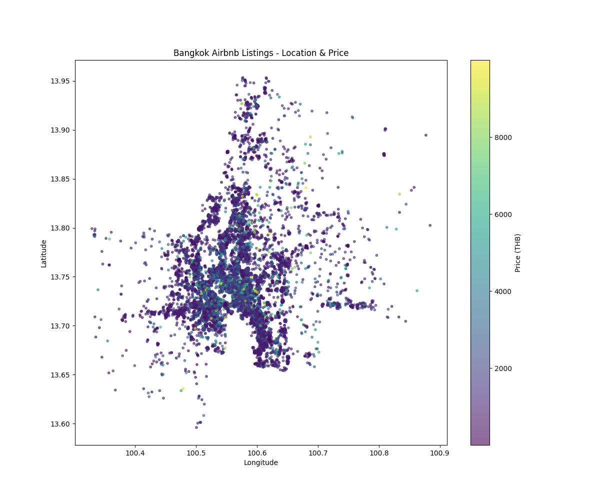
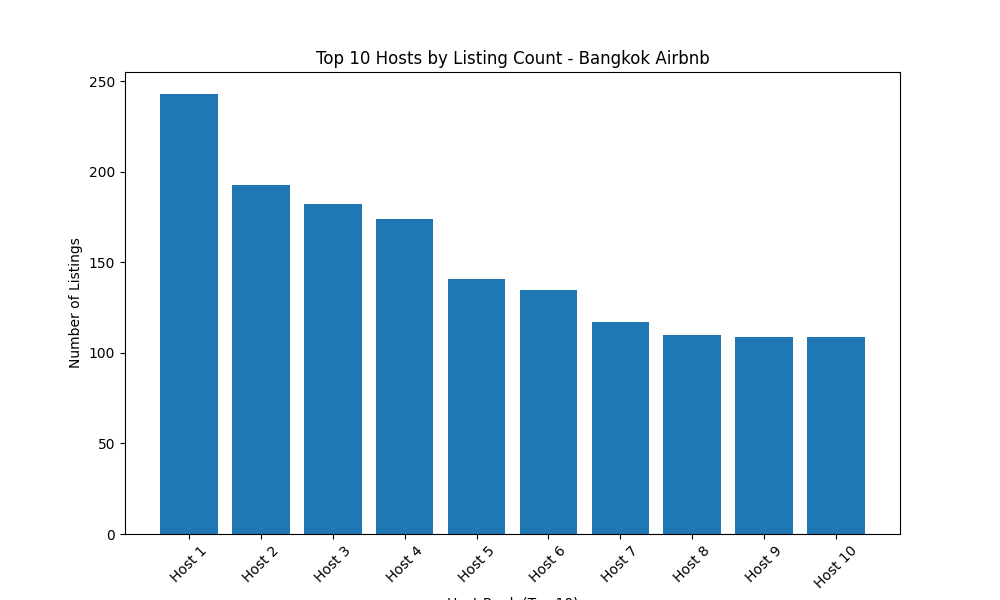

# EDA FINDINGS - Bangkok Airbnb

## 4.1 Price Distribution

**Finding:** Right-skewed distribution.

Key statistics:
- Median price: 1,379 THB/night (~$38 USD)
- Mean price: 2,528 THB/night (~$70 USD) - inflated by outliers
- 25th percentile (Q1): 923 THB
- 75th percentile (Q3): 2,207 THB
- Most listings (50%) fall between 923-2,207 THB/night
- 9% of listings (2,154) flagged as statistical outliers above 4,133 THB
- Extreme maximum: 1,000,000 THB (single luxury/error listing)

**Business Interpretation:
The gap between median (1,379 THB) and mean (2,528 THB) confirms the 
right-skew — a small number of premium listings inflate the average, 
making it a misleading benchmark for pricing decisions. A new host 
should target the 923-2,207 THB range (the middle 50% of the market) 
to remain competitive, rather than anchoring to the average price. 
The 9% of listings priced above 4,133 THB represent a distinct luxury 
segment that likely requires superhost status, premium amenities, or 
strong branding to justify pricing 3x above the market median.

## 4.1 Price by Room Type

Statistics by room type:
| Room Type          | Median      | Std Dev | Count |
|--------------------|-------------|---------|-------|
| Hotel room         | 1,708.5 THB | 1,853   | 198   |
| Entire home/apt    | 1,500 THB   | 16,770  | 16,498|
| Private room       | 1,090 THB   | 16,336  | 6,263 |
| Shared room        | 360 THB     | 1,087   | 314   |

Business Interpretation:
Hotel rooms command the highest median price (1,708.5 THB) with low 
variability, suggesting standardized, predictable pricing - typical 
of professional hospitality operators. Entire homes show high price 
variability (std=16,770) despite a lower median, indicating a mix of 
budget and ultra-luxury properties within this category.

## 4.2 Geographic Pricing Distribution

**Finding:** 
The densest concentration of Airbnb listings is centered around 
longitude 100.5-100.6, latitude 13.65-13.80 (central Bangkok). However, 
most listings in this high-density zone are mid-range priced, not premium.

Luxury listings (8,000+ THB) are sparse and geographically scattered 
throughout the city rather than concentrated in one specific district.

**Business Interpretation:**
Unlike cities such as Paris or New York, where luxury accommodation 
clusters in defined premium neighborhoods, Bangkok's luxury Airbnb 
market lacks a single dominant high-end district. This suggests luxury 
demand is driven by individual property quality rather than location 
prestige. For an investor, location selection is less critical than 
property quality for premium listings.

## 4.4 Host Concentration (Power Law Analysis)

**Finding:**
Listing ownership in Bangkok follows a strong power law distribution:
- Total unique hosts: 8,874
- Median listings per host: 1 (most hosts own a single property)
- Mean listings per host: 3.25 (inflated by large operators)
- Top host owns 243 listings
- Top 1% of hosts (88 individuals/companies) control 21.31% of 
  all 28,806 listings

**Business Interpretation:**
Despite Airbnb's "sharing economy" branding, Bangkok's market shows 
clear signs of professionalization. While the majority of hosts (median 
= 1 listing) are likely individual homeowners renting a spare room or 
apartment, a small group of commercial operators - just 88 hosts - 
control over a fifth of the entire market's supply. This has several 
implications: (1) For new individual hosts, competing on price alone 
against professional operators with economies of scale will be 
difficult; differentiation through unique amenities or personal service 
may be more effective. (2) For regulators, this concentration suggests 
that "short-term rental" policy debates framed around individual 
homeowners may be missing the larger commercial players who likely 
operate similarly to small hotel chains. (3) For investors, partnering 
with or studying these top operators could reveal scalable, proven 
business models in the Bangkok market.

